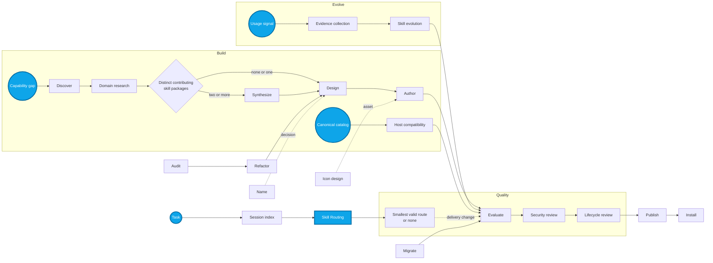
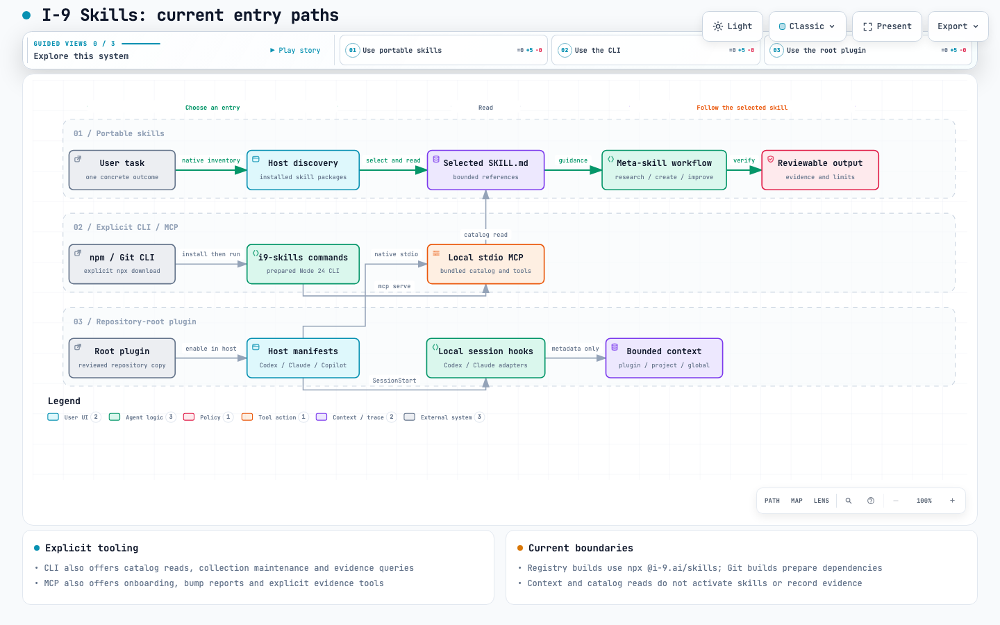

# I-9 Skills

> Build agent skills that stay focused, portable, secure, and easier to improve over time.

I-9 Skills is a toolkit for the full life of an agent skill: discover what already works, design one clear responsibility, author a complete package, validate it, publish it deliberately, and evolve it from real evidence. Every package is written in English, includes its own Apache-2.0 `LICENSE`, and works without assuming Codex, Claude, Copilot, OpenCode, or any other specific agent.

**24 focused skills. One responsibility each. One reviewable output each.**

The working package version is recorded in [package.json](package.json). This is
an experimental collection for explicit pilots; the npm package remains private
and unpublished. Structural checks and fixture tests do not establish production
quality or universal host compatibility.

The prepared CLI package name is `@i-9-ai/skills` and its executable is
`i9-skills`. In a trusted checkout, run `npm ci`, then `npm run check` and
`npm run package:check` on Node.js 24+. Read the
[distribution preparation](docs/Distribution%20Readiness.md) for the local packed
test and the separate future registry/plugin release boundaries. This repository
is itself a plugin for Codex, Claude Code and Copilot: their root manifests
reference the one canonical `.agents/skills` collection. Its Codex marketplace
entry is included for review; importing or installing remains a separate
consumer action after merge.

## Install

### Easiest: ask your agent

> Install the I-9 Skills collection for my current agent using the Skills CLI. First list the available packages from `https://github.com/i-9-ai/skills`, then install every package supported by this agent in my global user scope. Do not modify this project. Report the installed packages, the destination scope, and any package or host capability that could not be installed.

### CLI: install for this project

```sh
npx skills@1.5.26 add https://github.com/i-9-ai/skills --skill '*' --yes
```

### CLI: install globally

```sh
npx skills@1.5.26 add https://github.com/i-9-ai/skills --global --skill '*' --yes
```

These commands pin the installer and use the repository's default branch. For a
repeatable production installation, replace the repository URL with a reviewed
immutable revision.

The Skills CLI asks for a supported agent target when it cannot determine one. After installation, start a new agent session if its skill picker does not refresh automatically.

## Available skills and optional session hook

This source checkout includes a project-local Codex `SessionStart` adapter. After explicit `npm ci`, a trusted host can load a compact map from current project and global skill entrypoints at startup, resume, clear and compaction. Discovery reads bounded metadata, deduplicates canonical paths, and never installs packages or invokes a route.

The repository-root Codex and Claude plugins also bundle their own Node 24
session adapters, runnable without preparing the checkout. They discover plugin,
project and global skills. Claude additionally records supported native Read
attempts and successes in its host-provided plugin data directory. These counts
do not prove skill activation. See [installed plugin hooks](docs/Host%20Hooks.md#installed-plugin-hooks)
for supported versions, trust, storage and parser limits. The [native pilot](docs/Native%20Plugin%20Pilot.md)
records isolated Codex/Claude installation, SessionStart and local source rollback;
it does not establish real-model behavior or hosted updates. Avoid duplicate
project/plugin session registrations.

Hosts without hooks, or projects where the user has not enabled hook trust, use the identical manual fallback:

```sh
node bin/index.mjs context available-skills
```

The map lists discovered packages dynamically, labels their sources, and discloses omitted packages and incomplete coverage. Use `--no-global` for project-only discovery. Read the selected `SKILL.md` before use. The [CLI guide](bin/index.md) documents commands, limits, hooks and usage metrics.

## Suggested entry points

> [!IMPORTANT]
> **Start here: [Skill Routing](.agents/skills/skill-routing/SKILL.md)**
> Give it the desired outcome, constraints, and whether independent work may run in parallel. It returns the smallest suitable route, a bounded ambiguity shortlist, or `none`.

| Typical need | Recommended entry point | You get… |
| --- | --- | --- |
| **Global entry point** | **[`skill-routing`](.agents/skills/skill-routing/SKILL.md)** | *One recommended skill, a short ordered route, an ambiguity shortlist, or `none`* |
| Find strong existing approaches before building | [`skills-discovery`](.agents/skills/skills-discovery/SKILL.md) | A qualified candidate report |
| Research a proposed skill's subject and governing evidence | [`skill-domain-research`](.agents/skills/skill-domain-research/SKILL.md) | A bounded evidence dossier |
| Turn a vague idea into one well-scoped package | [`skill-design`](.agents/skills/skill-design/SKILL.md) | A design brief with boundaries |
| Create or revise a portable package | [`skill-authoring`](.agents/skills/skill-authoring/SKILL.md) | A complete skill package |
| Improve an existing collection safely | [`skills-audit`](.agents/skills/skills-audit/SKILL.md) or [`skill-evolution`](.agents/skills/skill-evolution/SKILL.md) | Evidence-linked findings or an evolved candidate |
| Plan recurring collection maintenance | [`skills-maintenance-scheduling`](.agents/skills/skills-maintenance-scheduling/SKILL.md) | Approval-ready schedule proposal or `none` |
| Release or install an approved revision | [`skill-publication`](.agents/skills/skill-publication/SKILL.md) or [`skill-installation`](.agents/skills/skill-installation/SKILL.md) | A publication or installation receipt |

When no package clearly fits, choose no skill. The catalog is a shortlist, never a substitute for reading the selected `SKILL.md`.

## Collection

Consult [`skills-catalog.json`](skills-catalog.json) for the generated machine-readable inventory. Use its descriptions and tags only to shortlist candidates, then read the selected package's `SKILL.md`. The table below is ordered by a typical user journey and centrality, not alphabetically. Choose no skill when none clearly matches.

| Skill | Responsibility | Primary output |
| --- | --- | --- |
| **[`skill-routing`](.agents/skills/skill-routing/SKILL.md)** | **Select a skill, short sequence, shortlist, or no skill** | **Routing decision** |
| [`skills-host-compatibility`](.agents/skills/skills-host-compatibility/SKILL.md) | Verify repository-local aliases for a canonical collection | Structural compatibility report |
| [`skills-discovery`](.agents/skills/skills-discovery/SKILL.md) | Find and qualify existing packages for one capability | Candidate report |
| [`skill-domain-research`](.agents/skills/skill-domain-research/SKILL.md) | Reconcile process-owner, reviewed-package, and authoritative domain evidence | Research dossier |
| [`skill-design`](.agents/skills/skill-design/SKILL.md) | Resolve one skill's responsibility and interface | Design brief |
| [`skill-naming`](.agents/skills/skill-naming/SKILL.md) | Choose a collision-aware domain-first name | Naming decision |
| [`skills-synthesis`](.agents/skills/skills-synthesis/SKILL.md) | Combine useful contributions from reviewed sources | Synthesis plan |
| [`skill-authoring`](.agents/skills/skill-authoring/SKILL.md) | Author one complete skill package and coordinate creation handoffs | Skill package |
| [`skill-icon-design`](.agents/skills/skill-icon-design/SKILL.md) | Design one distinctive, accessible package icon | Validated SVG icon and large PNG rendering |
| [`skill-evaluator`](.agents/skills/skill-evaluator/SKILL.md) | Evaluate one candidate against frozen behavioral cases | Evaluation report |
| [`skill-security-review`](.agents/skills/skill-security-review/SKILL.md) | Assess one package's security and disclosure risk | Security decision |
| [`skill-lifecycle-review`](.agents/skills/skill-lifecycle-review/SKILL.md) | Decide one skill's lifecycle state and next transition | Lifecycle decision |
| [`skill-publication`](.agents/skills/skill-publication/SKILL.md) | Publish one approved revision through one authorized channel | Publication receipt |
| [`skill-installation`](.agents/skills/skill-installation/SKILL.md) | Install one approved immutable package | Installation receipt |
| [`skills-snapshot`](.agents/skills/skills-snapshot/SKILL.md) | Create, verify, restore, and retain a selected local skill snapshot | Restorable snapshot |
| [`skills-maintenance-scheduling`](.agents/skills/skills-maintenance-scheduling/SKILL.md) | Design bounded recurring maintenance without creating execution authority | Maintenance schedule proposal or `none` |
| [`skills-audit`](.agents/skills/skills-audit/SKILL.md) | Audit a bounded collection for integrity and policy drift | Collection audit |
| [`skill-evidence-collection`](.agents/skills/skill-evidence-collection/SKILL.md) | Organize bounded evidence for a later skill decision | Evidence packet |
| [`skill-evolution`](.agents/skills/skill-evolution/SKILL.md) | Update one skill from supported new evidence | Evolved candidate and evolution record |
| [`skill-optimization`](.agents/skills/skill-optimization/SKILL.md) | Improve one skill through measured candidate iterations | Best accepted candidate and optimization record |
| [`skills-refactoring`](.agents/skills/skills-refactoring/SKILL.md) | Design a focused reorganization of an audited collection | Refactoring plan |
| [`skill-migration`](.agents/skills/skill-migration/SKILL.md) | Move one skill between collections | Migrated package and migration record |
| [`skills-catalog`](.agents/skills/skills-catalog/SKILL.md) | Derive and validate a collection inventory | `skills-catalog.json` |
| [`skills-catalog-index`](.agents/skills/skills-catalog-index/SKILL.md) | Query explicit collections and retain local changes/evolution evidence | Local aggregate index and history |
## From idea to durable skill system



The arrows represent artifact handoffs. Start a user task at **Skill Routing**; start collection maintenance at the **Canonical catalog**. The available-skills overview reads installed package metadata; the session hook supplies that same compact view at startup. Neither is another source of truth. A host may execute stages sequentially or delegate them; subagents are optional. Specialists never assume a companion is installed, invoke another skill recursively, or acquire authority from a handoff.

[Explore the interactive entry-path map](docs/assets/skill-management-entry-paths.html). Its source specification is [`docs/diagrams/skill-management-entry-paths.json`](docs/diagrams/skill-management-entry-paths.json), while the generated interactive artifact is [`docs/assets/skill-management-entry-paths.html`](docs/assets/skill-management-entry-paths.html).

[](docs/assets/skill-management-entry-paths.html)

A typical creation run qualifies sources, researches the proposed skill's subject against current authoritative evidence and the process-owner record, synthesizes distinct useful contributions, designs the boundary, authors the package, evaluates behavior, reviews security, and determines lifecycle readiness. Publication and installation remain explicit external actions. Existing collections enter through audit and refactoring; evidence-backed updates enter through evolution. Measured iterative improvement enters through optimization before evaluation. Recurring maintenance begins with `skills-maintenance-scheduling`, which returns an approval-ready proposal and leaves scheduler configuration and every maintenance side effect behind separate gates.

## Principles that keep the collection useful

- **Focused by design.** Split mixed responsibilities instead of creating a large, opaque platform skill.
- **Portable by default.** The package contract is standard Markdown and local resources; host UI metadata is optional.
- **Evidence before promotion.** A weak signal becomes a hypothesis or experiment, not a new rule.
- **Public-ready from day one.** No secrets, private paths, customer records, or implicit credentials belong in a package.
- **Human authority for external effects.** Validation, discovery, and handoffs never authorize publishing, installation, or other external actions.

## How this differs from SkillOpt

[Microsoft SkillOpt](https://github.com/microsoft/SkillOpt) is a research implementation for optimizing a skill document through scored rollouts, reflective bounded edits, and held-out validation. Its method directly informs skill-optimization.

This collection covers the surrounding lifecycle as well: discovery, source qualification, synthesis, responsibility design, authoring, security review, cataloging, routing, installation, migration, publication, and lifecycle decisions. Each remains a separate package with a narrow output.

Skill optimization can use a compatible engine such as SkillOpt when the caller explicitly authorizes its installation and execution. It is never an implicit dependency: packages remain agent- and provider-agnostic, and optimization evidence must still feed the independent evaluator and lifecycle gate.

## Use after installation

### Your first improvement

After installing the collection, paste this prompt into your agent to assess an existing project without changing it:

> Use `skills-audit` to inspect this project's installed skills. Produce a concise, evidence-linked audit that identifies missing package-contract elements, mixed responsibilities, security or public-hygiene risks, and catalog drift. Do not edit files, install packages, or publish anything. Recommend `none` when the collection is already fit for purpose.

### Compatibility at a glance

| Environment | What is supported here | Notes |
| --- | --- | --- |
| Agent Skills compatible host | Portable `SKILL.md`, local resources, and scoped licenses | The package contract is the baseline. |
| Skills CLI | Repository discovery plus project or global installation | Installation is an explicit user action. |
| Codex | Optional interface metadata and distinct package icons | Defined in each package's `agents/openai.yaml`. |
| Claude | Collection alias and repository guidance | No Claude-specific package metadata is required. |
| GitHub Copilot and other hosts | Portable package contract | Confirm host discovery and UI behavior in the consumer environment. |

This is a capability matrix, not a claim that every host will render the same interface. The first independent Harness pilot will publish reproducible before-and-after evidence here once it is complete.

Packages live in `.agents/skills`. The repository exposes relative aliases at `.github/skills` and `.claude/skills`, while `CLAUDE.md` and `GEMINI.md` point to `AGENTS.md`. Optional `agents/openai.yaml` files provide Codex interface metadata. Every package has a distinct source-attributed SVG icon and a matching PNG large-icon rendering; collection validation rejects missing, unsafe, or byte-identical SVG icons and missing interface assets.

Installed skills resolve references, assets, and scripts from their own package directory and write outputs to the caller-selected workspace. They do not depend on this checkout, its `skills-catalog.json`, repository commands, or CI. A missing companion produces a clear handoff; it never authorizes silent installation.

## Source-checkout validation

Local repository tooling uses Node.js 24+, pinned oclif, TypeScript and Prettier:

```sh
npm ci
npm run check
git diff --check
```

The [validation contract](docs/Validation.md) explains the layered checks. Every package must also pass the official `skills-ref validate` tool identified by the [Agent Skills specification](https://agentskills.io/specification#validation). GitHub Actions installs the pinned external Python validator in an isolated environment and validates every canonical package at the exact PR revision.

Pending user-visible changes use [Changesets](docs/Release%20Management.md) for
version intent and future release notes. A manual workflow can prepare a draft
version PR with an aligned package, lockfile and plugin manifests. Normal PR
checks still apply; preparation does not publish packages, create tags or create
releases. The release guide also covers local preparation and no-note retries.

Catalog maintenance is automated:

```sh
node bin/index.mjs catalog check --collection . --layout repository
node bin/index.mjs catalog sync --collection . --layout repository --dry-run
node bin/index.mjs catalog sync --collection . --layout repository
```

The sync command derives names, paths, descriptions, and tags from each `SKILL.md`, writes only `skills-catalog.json`, and becomes a no-op on a second run. Lifecycle evidence remains a separate review record.

To query the collection bundled with the running CLI, use `catalog search --query
authoring`, `catalog read --skill skill-authoring`, or `catalog overview`. The same
read-only operations are available through `mcp serve`, without a data directory
or native skill discovery. The [MCP guide](docs/Skill%20MCP.md) includes tool calls,
bounded resource retrieval, provenance and optional explicit usage metrics.

Codex, Claude and Copilot root plugins register that shared MCP directly, without
CLI dependencies. The legacy Codex and Copilot mappings need explicitly selected
external `PLUGIN_DATA` and `COPILOT_PLUGIN_DATA` directories, respectively, for
storage; reads of catalog/guide/report data do not need one. The
[Codex MCP pilot](docs/Codex%20MCP%20Pilot.md) and
[Copilot MCP pilot](docs/Copilot%20MCP%20Pilot.md) document native tool calls,
isolation and the operator's responsibility for the consumer path.

[Lifecycle evidence](docs/Lifecycle%20Evidence.md) provides separate explicit
route, activation and outcome records, complete catalog observations and
read-only cohort, overlap, inactivity and history queries through the same
CLI/MCP. These are caller-reported signals with visible denominators and coverage;
catalog retrieval and file reads do not manufacture activation evidence.

[Skill memory inspection](docs/Skill%20Memory.md) combines bounded summaries of
those records through `skills memory summarize`. `skills memory retention`
inspects a caller-supplied cutoff within the selected period; it does not delete
history or decide what is safe to remove. Both commands use the existing evidence
store in read-only mode and distinguish source-qualified lifecycle assertions
from name/revision-only read receipts.

### Cross-collection lookup

Each repository keeps its own `skills-catalog.json` as its canonical, versioned inventory. When a local workstation needs to compare explicitly selected collections, the separate `skills-catalog-index` package can derive `skills-catalog.db` outside every source repository. SQLite `sync` retains source observations and normalized added, changed, and removed skill history; `history` and `changes` inspect it. The deterministic `skills-catalog.index.json` fallback provides current lookup only. Neither index alters a source catalog, installs or activates a skill, grants permissions, or runs setup. The repository's `catalog aggregate` CLI routes reuse that standalone package. See the [aggregate-index contract](.agents/skills/skills-catalog-index/references/aggregate-index.md) for commands, bounds, retention, and storage rules.

## Provenance and security

[`upstreams.lock.json`](upstreams.lock.json) records immutable benchmark sources and file hashes for future comparison. It is evidence for review, not an installer lock or automatic updater. Popularity, marketplace rankings, and external audit badges do not establish production quality.

Read [`SECURITY.md`](SECURITY.md) before reviewing external packages. Never commit credentials, personal or client records, private source snapshots, local paths, or environment inventories. External scripts remain inert during discovery. Reuse requires a compatible scoped license and preserved notices.

## Contributing

Read [`AGENTS.md`](AGENTS.md), the [authoring standards](docs/Authoring%20Standards.md), and the [architecture](docs/Architecture.md). Keep changes in English, prefer small skills with independently testable outputs, use Node.js built-ins for portable deterministic helpers when practical, update the generated catalog, and include exact-revision validation evidence.

For public-facing messaging and demonstrations, use the [positioning and communication strategy](docs/Positioning.md). It explains how to present the framework's modularization and evidence-gated evolution without making unsupported claims.

For material repository changes, use the host's planning mode when available and preserve the [portable planning protocol](docs/Planning%20Protocol.md) in a versioned plan.

Original I-9 content is licensed under [Apache-2.0](LICENSE). Each distributed package includes its own `LICENSE`.
