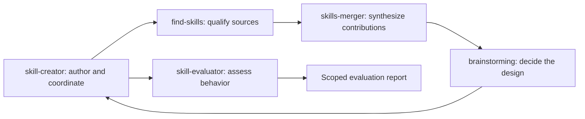

# I-9 Skills

A curated collection of focused, reusable skills. Each skill has one responsibility, is written in English, includes its own `LICENSE`, and describes capabilities without requiring a particular AI agent or provider.

The initial collection builds and improves other skills through explicit handoffs:



The arrows represent returned artifacts, not recursive skill invocations. The creator may consult brainstorming during intake when the responsibility is unclear. Synthesis requires at least two distinct usable sources; otherwise it is explicitly skipped. Evaluation failures return to authoring within a bounded correction budget.

| Skill | One responsibility | Primary output |
| --- | --- | --- |
| [skill-creator](.agents/skills/skill-creator/SKILL.md) | Author a complete package and coordinate its handoffs | Skill package |
| [find-skills](.agents/skills/find-skills/SKILL.md) | Discover and qualify relevant sources | Candidate report |
| [skills-merger](.agents/skills/skills-merger/SKILL.md) | Select complementary contributions and resolve overlap | Synthesis plan |
| [brainstorming](.agents/skills/brainstorming/SKILL.md) | Decide the skill's boundary and interface | Design brief |
| [skill-evaluator](.agents/skills/skill-evaluator/SKILL.md) | Assess behavior against frozen cases and a baseline | Evaluation report |

## Use the collection

Read the selected package's `SKILL.md` and provide your task and inputs. For coordinated creation, make all five packages from the same approved checkout available and identify `skill-creator` explicitly. The same agent can perform the stages sequentially; subagents are optional. A missing companion produces a clear handoff instead of a silent substitution with another package of the same name.

Example request:

> Use this collection's skill-creator to build an English skill for preparing a GitHub issue from a bug report. Keep it focused on the issue artifact. Discover relevant sources, compare useful contributions, include LICENSE and provenance, and evaluate positive, negative, and unsafe-input cases. Write only to the selected local workspace.

The skills use the portable [Agent Skills format](https://agentskills.io/specification). Their model-profile metadata is advisory: it describes a useful capability level and never requires a provider or switches the runtime. Current recommendations are explicitly unbenchmarked. See [compatibility](docs/compatibility.md) for actual coverage and limitations.

Packages live in `.agents/skills`, so compatible project agents can use the same skills that this repository maintains. `.github/skills` and `.claude/skills` are relative symlinks to that canonical directory; `CLAUDE.md` points to `AGENTS.md`. Other documented hosts that already discover `.agents/skills` need no duplicate tree. Optional `agents/openai.yaml` and original SVG icons provide Codex UI metadata without changing the core.

## Optional local tooling

The scaffold and custom integrity helper use Python 3.10+ on Linux or macOS, with no dependencies or API credential. From the repository root:

```sh
mkdir -p .work
python3 .agents/skills/skill-creator/scripts/skill_tools.py init example-skill --output .work
python3 .agents/skills/skill-creator/scripts/skill_tools.py validate-skill .work/example-skill
python3 .agents/skills/skill-creator/scripts/skill_tools.py validate-run .agents/skills/skill-creator/examples/merge-run/run.json
```

The initializer creates a licensed scaffold; an agent still authors and evaluates the skill. The custom checks assess structure and evidence integrity, not model quality or licensing compatibility. [Tooling documentation](.agents/skills/skill-creator/references/tooling.md) covers supported inputs, bounds, and errors. Manual inspection can continue where the optional helper is unavailable.

Every new or modified skill also requires the official **`skills-ref validate`** check. Follow the [pinned validation setup](docs/validation.md), using Python 3.12 and Node.js 22+. The GitHub workflow runs this official tool on every canonical skill in every PR, alongside repository checks and Python/Node tests. A missing or failed official check blocks readiness.

Add `--with-openai` when creating a scaffold to include the optional Codex interface and local icon. New skill utilities should prefer Node.js; this Python helper is a documented exception for safe descriptor-relative filesystem operations, with no native dependency.

## Provenance and maintenance

The [research ledger](docs/upstream-research.md) compares the cited skills.sh candidates and relevant alternatives at immutable revisions. [upstreams.lock.json](upstreams.lock.json) records source package and file SHA-256 values, licenses, and consumers for future upstream comparisons. It is benchmark evidence, not an installation lock or an automated updater. Popularity and a source hash do not certify production quality.

All five initial skills are `pilot` in [catalog.json](catalog.json). The [pilot report](docs/pilot-evaluation.md) records the actual synthetic creation exercise and its evaluation limits. Review, behavioral evaluation, provider testing, consumer migration, releases, and public distribution remain distinct states. This change does not change repository visibility or install skills into consumers.

## Contribute

Start with [AGENTS.md](AGENTS.md), [authoring standards](docs/authoring-standards.md), and [architecture](docs/architecture.md). Prefer narrowly scoped skills over platform-wide bundles; related skills coordinate through explicit interfaces. Keep executable helpers tested, sources traceable, and examples synthetic. Run the checks above and submit a focused English pull request.

Original content is licensed under [Apache-2.0](LICENSE). Every distributed skill includes `LICENSE`; any future copied third-party material must retain its own required rights, notices, and attribution. Read [SECURITY.md](SECURITY.md) before handling external source packages or reporting a vulnerability.
