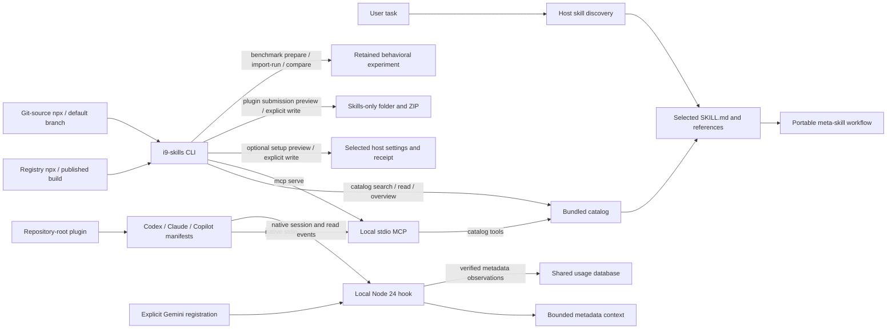
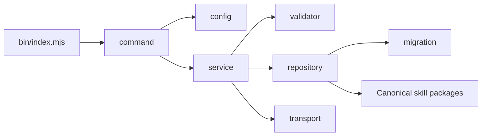
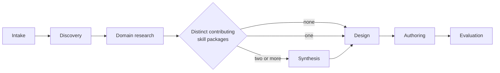
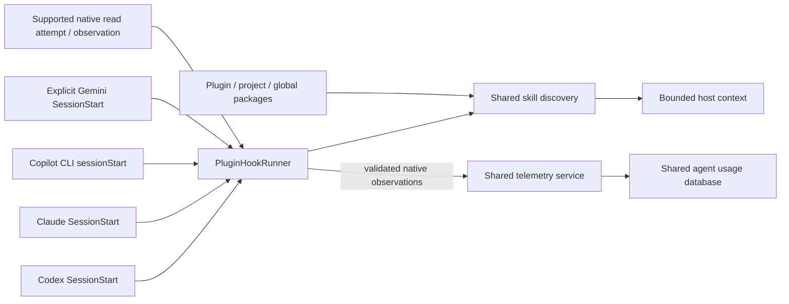
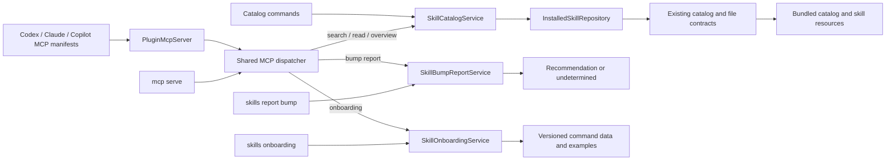
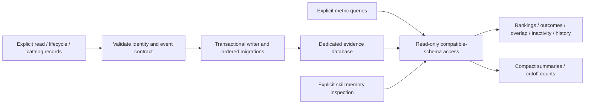
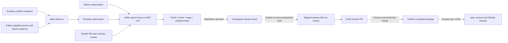
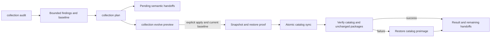
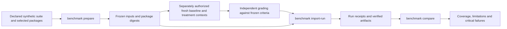

# Architecture

## Current entry paths

The portable packages, prepared CLI and repository-root plugin are separate
entry paths into the same collection. The CLI starts from `bin/index.mjs`;
native plugin adapters start local transports directly, without preparing the
CLI or fetching dependencies during a host event.

The ordinary Git-source `npx` call follows the repository's default branch and
runs its explicit preparation lifecycle. An explicit full commit SHA selects an
immutable revision when reproducibility is needed. Published registry builds use
`npx @i-9.ai/skills` with already compiled code. Hook context discovers plugin,
project and global
packages through the shared state configuration. MCP
catalog access uses the installed bundled catalog and returns selected Markdown.
Context display and catalog retrieval do not establish a read or activation;
native session/read receipts are validated separately. The CLI
also exposes explicit collection maintenance, observations, reports and evidence
queries; the MCP exposes the catalog, onboarding, bump reports and explicit
evidence tools. See [CLI distribution](https://github.com/i-9-ai/skills/wiki/Distribution-Readiness),
[plugin preparation](https://github.com/i-9-ai/skills/wiki/Plugin-Preparation) and
the [interactive entry-path map](https://i-9-ai.github.io/skills/skill-management-entry-paths.html).

## Responsibility boundaries

The collection is organized around independently useful tasks, not vendors or platforms. The skills own discovery, synthesis, design, authoring, evaluation, and naming. `skill-authoring` is the entrypoint for producing a package and only coordinates the other procedures. `skills-synthesis` produces the synthesis contract; it does not also search the web, author code, or grade its own output. `skill-naming` owns open naming decisions and returns a report without renaming files.

For example, a GitHub collection might separate CLI command selection, issue preparation, pull request delivery, action usage, and workflow authoring when their outcomes and acceptance criteria differ. This illustrates the general responsibility test rather than prescribing domain categories. Keep cohesive steps together when splitting them would create no independently useful capability.

## Repository tooling layers

The checkout CLI runs on Node.js 24 with pinned oclif and erasable TypeScript. `package.json` centralizes dependencies and the official tool pins. Run `npm ci` explicitly before local checks. The creator's self-contained helper remains inside its package.

| Layer | Responsibility |
| --- | --- |
| CLI | Select a use case, present results, and set the process exit status |
| config | Resolve named paths, command routes and runtime options without I/O |
| service | Coordinate validation, discovery, maintenance, evidence queries and reports |
| validator | Reusable catalog, provenance, public-hygiene and official-source checks |
| repository | Filesystem/process access, installed resources and separate evidence aggregates |
| migration | Ordered checksum-verified SQLite schema history |
| transport | Bounded MCP protocol handling |

Validators do not launch processes or read files. Services coordinate validators and repositories; commands own parsing/output. A thin `bin/index.mjs` launches the CLI. The [source index](https://github.com/i-9-ai/skills/blob/main/src/AGENTS.md) records these boundaries. Python is installed only by the workflow for the upstream `skills-ref` command; no repository-owned validation logic is implemented in Python.

## Path ownership and shared agent state

`AgentStateConfiguration` names the host-independent global resources without
filesystem effects. The root is `I9_AGENT_STATE_ROOT` when explicitly supplied,
otherwise `HOME/.agents` (with the platform home fallback). CLI available-skills
and session commands and the native plugin discovery adapter use its `skills/`
directory. An explicit CLI `--global-root` wins; `--no-global` skips global
discovery entirely. `SkillDiscoveryRepository` still accepts only selected
source directories: it does not independently choose a home or scan plugin caches.
Live metadata discovery does not depend on a catalog being fresh or readable.

| Resource | Path owner and default | Material boundary |
| --- | --- | --- |
| Repository skill inventory | `<collection>/skills-catalog.json` | Canonical source-owned inventory; repository layout reads `.agents/skills/` |
| Global skill inventory | `<agent-state>/skills-catalog.json` | Explicit global catalog operation; reads that root's `skills/`; discovery itself never rewrites it |
| Read/lifecycle evidence | `<agent-state>/skills-usage.db` | Shared CLI/plugin default; `I9_SKILLS_USAGE_DB` overrides it, and explicit `--db` wins |
| Derived catalog index | `<caller-index>/skills-catalog.db` or `skills-catalog.index.json` | Explicit output outside every source catalog directory; independent schema and history |
| Snapshot and installation records | Caller-selected operation state | Keep outside discovery/source roots under the selected package's recovery contract |

Native plugin DATA variables do not select telemetry storage. Config lookup and
read-only queries never create state. Valid explicit records and verified native
observations may initialize safe selected parents and compatible schema history.
The default change never renames, merges, resets or deletes old stores; select an
old filename explicitly to inspect its original evidence.

The aggregate index intentionally has no compulsory home default. Its package
accepts explicit source catalogs and confines output outside each source catalog's
directory. If the global source catalog is `<agent-state>/skills-catalog.json`,
placing the derived index inside that same agent-state root would violate the
existing confinement contract. Choose an owned sibling or other external output,
for example source `/data/agent-state/skills-catalog.json` with output
`/data/catalog-index/`. The usage database is never an aggregate destination.
Do not present a JSON fallback or new path as a history migration.

Distributed catalog, catalog-index, snapshot and installation packages retain
their explicit caller-owned roots and package-relative helpers. Shared home
defaults belong to repository/host configuration adapters; portable skills do
not require this checkout, these environment variables or a plugin cache path.

## Execution contract

The [creator's handoff protocol](https://github.com/i-9-ai/skills/blob/main/.agents/skills/skill-authoring/references/handoff-protocol.md) owns the run format. Specialists can be installed and used alone through their local inputs/outputs; they need no repository root files. The creator locates separately available companions through the host's inventory or trusted explicit paths and wraps their returned artifacts in ordered stages with SHA-256 evidence. Resource paths belong to the installed package; outputs belong to the caller's selected workspace.

Stages are intake → discovery → domain-research → conditional synthesis → design → authoring → evaluation. The creator may consult `skill-design` within intake before discovery when clarification is needed; that preliminary brief does not replace the final design stage. Domain research always opens current public authoritative sources relevant to the proposed skill's subject and preserves the process-owner record, scope, date, conflicts, and unknowns. With no contributing skill package, synthesis is skipped with evidence. With one contributing package, its useful contributions go directly to design alongside the research dossier. Synthesis compares two or more distinct contributing packages. Mirrors and revisions of the same source do not fill the contribution requirement.

Every stage returns its result, evidence, limitations, and next consumer. The coordinator verifies the output before continuing. Changed inputs invalidate dependent stages. Missing capability, rights, authority, or critical test evidence produces a blocked handoff. Correction loops default to two rounds; the intake can set a different justified budget.

The manifest is an audit artifact, not an executable workflow engine. Its status is an assertion supported by reports; integrity checks cannot certify that prose is true. It grants no tool authority and starts no subprocesses, models, schedulers, or background jobs.

Naming is conditional intake/design work, not a seventh run stage. Names group by domain affinity, with cardinality reflecting the primary unit. A naming report records the selected identifier, alternatives, known collisions, and affected consumers; the authoring coordinator applies an accepted rename.

## Optional delegation

One agent reading the relevant packages in sequence is the reference execution. Where supported and authorized, independent candidate inspections and evaluation cases may run concurrently in isolated workspaces. Workers receive the minimal brief, raw inputs, output contract, and action scope. They do not own shared mutable state or remote publication. The creator reconciles disagreements and verifies returned artifacts.

No runtime adapter is required for a distributed package. Optional Codex UI metadata and local icons accompany the packages; they do not execute a workflow or change the core. The project-local session-index adapter is separate: it renders bounded entry context from current project/global package metadata when a trusted host runs it, using `context available-skills` through `hook session-index`. It neither loads package bodies nor changes selection, installation, or execution authority. Resolve companion skills by the selected package set and identity; installed name collisions require explicit resolution. If a required package is missing, preserve completed work and name the missing capability rather than pretending that its stage ran.

The repository-root plugin has a dependency-free Node 24 hook transport. Host
manifests select native adapters; the common discovery repository receives a
metadata parser appropriate to the runtime. The prepared CLI uses full YAML;
the installed plugin uses the package-owned subset and reports incomplete
coverage. Context and observed-read persistence have independent failure paths.

Data stays outside installed bytes and the consumer project. A storage failure
does not suppress the available-skills overview. Read observations are counts,
not evidence of activation or a separate source of skill instructions. Native
host trust and event delivery require their own consumer tests; direct transport
tests and manifest validation establish a narrower boundary.

Codex accepts only bounded literal cat/sed Bash reads whose returned text matches
the selected current entrypoint after collection confinement. Claude accepts
native successful Read receipts. Gemini read_file and Copilot CLI view receipts
use bounded native timestamps, but their documented payloads cannot reliably pair
attempts with observations. Same-timestamp indistinguishable receipts may collapse.
No adapter infers activation, stores raw commands/bodies, or executes a read command.
See [native hook limits](https://github.com/i-9-ai/skills/wiki/Host-Hooks).

Optional telemetry setup is a separate explicit operation. Enable previews a
merge into a selected host file; `--write` records exact owned entries and a
sibling receipt. Status inspects registration/runtime availability, and disable
removes only unchanged owned entries after review. Setup never grants native host
trust, runs an agent or modifies the evidence database. Public submission
preparation similarly writes only its selected inert folder/ZIP; publication
remains a separate human-operated boundary.

## Installed MCP and read-only guidance

The CLI's `catalog search/read/overview` operations and `mcp serve` share one
bundled-catalog service. Installed module location selects the package, while
existing catalog validation checks declared identity and freshness. Retrieval
serves only `SKILL.md` or bounded Markdown references in the selected package;
it does not use project/global discovery or execute scripts. The same MCP
dispatcher also serves pure change reports and installed onboarding data. Explicit
records and metrics use a separate evidence store described below.

Protocol initialization, catalog reads, bump reports and onboarding create no
evidence database. Onboarding returns instructions; it never executes them.
Catalog access never implies a read observation or activation. Responses distinguish
package version, catalog/content digests and unavailable Git provenance; none is
silently substituted for another. See the [MCP contract](https://github.com/i-9-ai/skills/wiki/Skill-MCP).

## Explicit lifecycle and catalog evidence

The dedicated evidence database retains observed reads, explicitly reported
lifecycle outcomes and complete caller-reported catalog inventories. It is
separate from the rebuildable multi-collection catalog index. CLI and MCP
operations use the same validation and storage contracts.

A valid explicit record may initialize or upgrade the selected store. Queries
require existing compatible state and never create or migrate it. Retries retain
event identity; changed content or conflicting attempt stages fail instead of
overwriting history. Aggregate-index reset and rebuild operations reject this
database.

A host read observation is not an activation. Lifecycle records are emitter
assertions, catalog observations assert a complete inventory, and neither proves
successful execution or semantic quality. Metrics expose their denominators,
periods and missing coverage. No reported activity does not prove non-use. See
[lifecycle evidence](https://github.com/i-9-ai/skills/wiki/Lifecycle-Evidence) for event ordering, query budgets
and recovery, and [telemetry](https://github.com/i-9-ai/skills/wiki/Skill-Telemetry) for observed-read handling.

[Skill memory inspection](https://github.com/i-9-ai/skills/wiki/Skill-Memory) composes these projections in one
read snapshot. Summaries retain evidence identity and missing coverage; retention
inspection counts records around an optional caller cutoff within the queried
period. Neither operation establishes a retention policy, evaluates historical
dependencies for deletion, or writes to the database.

## Skill observations and version decisions

Snapshot observations and bump reports do not use the telemetry database.
`skills observe` verifies an existing schema-2 snapshot and exports a bounded
portable inventory with separately supplied source and check evidence. It does
not capture or restore a snapshot. The report compares two such observations and
requires an explicit semantic review of changed files and contracts.

Content identity alone cannot establish compatibility or a release category.
Incomplete, conflicting or insufficient evidence stays `undetermined`; a report
neither changes package versions nor creates release notes. An accepted result
may inform a separately authored Changeset. The version-preparation command then
updates release artifacts when invoked by the authorized workflow or a maintainer.
The draft version PR is reviewed before the workflow publishes its protected
merge and creates the version tag and GitHub release. See [skill change reports](https://github.com/i-9-ai/skills/wiki/Skill-Change-Reports)
and [release management](https://github.com/i-9-ai/skills/wiki/Release-Management).

## Explicit collection maintenance

The optional CLI composes package-owned validation, catalog derivation and
snapshots into a deterministic audit/plan/application workflow. It does not run
a model or transform semantic instructions. Plans bind to the selected collection
and its exact inspected state; application previews unless explicitly requested.

Only catalog synchronization is supported automatically. Malformed catalogs and
package content changes retain their own handoffs. Recovery captures only the
catalog preimage, not an entire repository. See [collection maintenance](https://github.com/i-9-ai/skills/wiki/Collection-Maintenance)
for explicit selections, limits and receipt semantics.

## Retained behavioral experiments

The candidate benchmark interface freezes a selected suite and exact package
bytes, imports externally produced artifacts, and compares paired baseline and
treatment observations. It has no model runner or evaluator. Its filesystem
records are separate from the usage database and catalog indexes.

Case scripts and model calls are never executed by these commands. Artifact
hashes bind the retained bytes; executor identity, configuration, metrics and
grading remain caller assertions. Missing runs, unknown controls and exceeded
budgets remain visible. A passing observation does not establish official
conformance, native-host integration or release readiness. See the
[behavioral benchmark guide](https://github.com/i-9-ai/skills/wiki/Behavioral-Benchmark)
for the candidate commands and the separate executor/evaluator handoff.

## Provenance and evolution

[upstreams.lock.json](https://github.com/i-9-ai/skills/blob/main/upstreams.lock.json) contains benchmark source identity and digests; [the research ledger](https://github.com/i-9-ai/skills/wiki/Upstream-Research) connects sources to retained and rejected ideas. The source commit locates a revision; the package digest identifies the captured file set, and per-file digests locate changes. Applicable license bytes are recorded separately when the license lives outside the package.

The skill-evolution package can resolve a new upstream revision, capture it under the same rules, compare added, changed, and removed files, and map differences to local contributions. It must distinguish improvements, already covered behavior, irrelevant changes, regressions, and license changes, then propose a bounded change with tests and a PR. Measured candidate improvement belongs to skill-optimization, which requires frozen splits, bounded edits, and a held-out gate. Hashes do not rank quality. No updater or monitor silently replaces accepted skills.

## Collection lifecycle

The canonical project path is `.agents/skills`. The Skills CLI explicitly searches it in the [inspected discovery implementation](https://github.com/vercel-labs/skills/blob/d667282815248da03a08a18272b5d2eef9caf77c/src/skills.ts). Repository aliases `.github/skills` and `.claude/skills` point to that directory, and `CLAUDE.md` plus `GEMINI.md` point to `AGENTS.md`. They exist for host discovery, not backward compatibility with an obsolete internal layout. Validators recognize only these exact aliases at the repository boundary; symlinks inside skill packages remain forbidden.

The catalog is a derived package inventory. The Git revision identifies the collection version; do not embed a self-referential HEAD hash in the catalog. Lifecycle evidence and decisions remain separate review records. A future consumer should pin an approved immutable revision and verify the selected package bytes in its own installation workflow. Releases, consumer migrations, and visibility changes require their own authorized delivery evidence.

A caller that needs to compare several explicitly selected collections uses the separate `skills-catalog-index` package to build a local derived `skills-catalog.db` from their validated `skills-catalog.json` manifests. Canonical inventory generation remains in `skills-catalog`. The aggregate is outside all source repositories, records logical source identifiers and catalog digests rather than local paths, and retains timestamped source observations plus normalized before/after skill changes. Its current source and skill tables remain a deterministic projection. The `skills-catalog.index.json` fallback provides the same current projection without history. These local indexes are not canonical catalogs, directory scanners, installers, activators, or source updaters.

Follow the [lifecycle policy](https://github.com/i-9-ai/skills/wiki/Lifecycle-Policy) to evaluate maturity through the target project's existing evidence and approval system, or a portable approval record when none exists. Catalog presence does not assign a lifecycle state. Upstream benchmarking and local structural validation are prerequisites, not proof of production operation.

Recurring collection maintenance begins with `skills-maintenance-scheduling`. It freezes an explicit package inventory and revision, inspects only project-local scheduling and approval mechanisms, and returns a cadence proposal with the real executor, evidence owner, stop condition, and rollback path. The default is advisory. Even when scheduler configuration is separately authorized, scheduled runs remain limited to proposing work or collecting read-only evidence; they cannot approve, modify, install, merge, or publish a skill.
