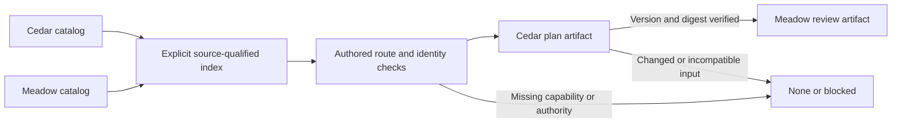

# Federated collections consumer pilot

Two separately owned collections can share catalog discovery and explicit artifact handoffs while retaining their own package identity, procedures and authority boundaries. This pilot consolidates the existing contracts and exercises them with original synthetic fixtures. It adds no automatic router, installer or universal execution runtime.

The [fixture](https://github.com/i-9-ai/skills/blob/main/tests/integration/collection/federated-consumer.fixture.json) contains fictional owners, three small packages, an authored route and one plan input. The [test](https://github.com/i-9-ai/skills/blob/main/tests/integration/collection/federated-consumer.test.mjs) materializes those packages in disposable directories, uses the real catalog/index helpers, and checks a bounded exchange of JSON artifacts. The route is supplied as test data; no model chose it or performed the specialist procedures.

## Interoperability contract

| Boundary | Required contract | What it does not establish |
| --- | --- | --- |
| Collection inventory | Schema version `1`; each entry has exactly `name`, package-relative `path`, `description` and sorted `tags`; check the selected catalog against its current entrypoints | Package-body identity, lifecycle state, trust or execution authority |
| Federated discovery | Caller-selected catalogs and distinct stable source IDs; retain `(source_id, name, path)` and the catalog SHA-256; preserve same-name records from different sources | A globally unique package name, an authenticated owner or a selected route |
| Package qualification | Inspect the selected SKILL.md and required resources; reconcile its metadata, responsibility, package content digest, license evidence and caller-reviewed source identity | Readiness from catalog presence or authorship from a metadata claim |
| Versioning | Keep catalog schema, artifact interface version, collection revision and package content identity separate; use an immutable reviewed source revision when available | A catalog digest cannot substitute for package bytes or a missing Git revision |
| Route | One skill or a short ordered sequence with a distinct required output at each step; record near-miss exclusions, setup readiness and coverage | Invocation, installation, delegation or model selection |
| Optional companion | Verify availability and identity through the caller's selected inventory; use the package's documented fallback when the companion is absent | Co-location, a transitive installation chain or authority to fetch a dependency |
| Handoff | Give the selected specialist the minimal input, compatible artifact version, source-qualified identities, expected output, artifact digest, limits and existing action authority; verify the returned artifact before dependent work | Authority beyond either the caller's grant or the specialist's own boundary |
| Failure | Return scoped `none` for no matching capability; block a dependent handoff when its selected package, authority or evidence is missing or changed; preserve completed evidence | Permission to repair, install, widen discovery or silently substitute a same-name package |

These rules come from the existing [catalog contract](https://github.com/i-9-ai/skills/blob/main/.agents/skills/skills-catalog/references/catalog-contract.md), [aggregate index contract](https://github.com/i-9-ai/skills/blob/main/.agents/skills/skills-catalog-index/references/aggregate-index.md), [routing procedure](https://github.com/i-9-ai/skills/blob/main/.agents/skills/skill-routing/SKILL.md), [selection rules](https://github.com/i-9-ai/skills/blob/main/.agents/skills/skill-routing/references/selection.md) and [companion handoff guidance](https://github.com/i-9-ai/skills/blob/main/.agents/skills/skill-authoring/references/handoff-protocol.md). The creator's seven-stage authoring manifest remains specific to authoring. The two-step record here illustrates a consumer handoff; it is not another public machine schema.

## Fixture ownership and selected route

| Collection and fictional owner | Package | Responsibility and disposition |
| --- | --- | --- |
| `cedar` — Fictional Cedar Skills Workshop | `skill-plan` | Selected producer: prepare one plan from the supplied brief; preserve a text-only fallback when optional `skill-diagram` is unavailable |
| `cedar` — Fictional Cedar Skills Workshop | `skill-review` | Rejected near miss: owns a publication decision from release evidence, outside the requested local plan review |
| `meadow` — Fictional Meadow Skills Review Cooperative | `skill-review` | Selected consumer: inspect the plan and return one local review artifact |

Each collection has its own root and schema-1 catalog. A caller-owned index and evidence directory sit outside both source roots. The catalogs contain only the common inventory fields; optional-companion and artifact details belong to the selected package. No source catalog imports or owns the other collection.

The authored sequence is `cedar:skill-plan` followed by `meadow:skill-review`. A lookup for `skill-review` returns both owners' records. Omitting the source ID blocks the fixture decision; selecting the Cedar near miss fails the declared capability/interface check. The pilot inspects actual entrypoint and license bytes and binds the reviewed package file inventory to its SHA-256. It records `git_revision: null` because the temporary fixtures have no Git provenance. The fictional source URLs are inert identifiers and are never fetched.



The caller permits only reading supplied input and writing local reports. The pilot allows at most three candidates, two stages and 4 KiB per artifact. The review records both selected package identities and the exact input digest. Its checks cover artifact format, digest and the presence of the primary output and exclusions. It explicitly reports `semantic_quality: not evaluated` and preserves `setup status unknown`; no skill activation or prerequisite verification is claimed.

## Reproduction and observed cases

From a checkout with Node.js 24 or newer, run:

```sh
node --test tests/integration/collection/federated-consumer.test.mjs
```

The fixture uses Node.js built-ins and the repository's existing self-contained helpers. It requires no network, credentials, real home directory, installed companion or host registration. Catalog synchronization occurs only while preparing the disposable fictional collections. The consumer run then preserves all source package and catalog bytes. Test cleanup removes only its own temporary directory.

The ten deterministic cases cover:

1. Source-qualified collision discovery, exact identity qualification, optional-companion fallback, a two-collection artifact exchange, and byte-identical index rebuilds with reversed source arguments.
2. A missing capability producing scoped `none`, and a missing selected reviewer producing `blocked` while retaining the completed plan.
3. A name-only collision blocking before a consumer artifact is created.
4. A same-name package with a different responsibility blocking the handoff.
5. A third stage exceeding the frozen budget.
6. A requested publication effect exceeding caller and specialist authority.
7. Changed package instructions blocking even though unchanged summary metadata still passes the catalog check.
8. Changed producer bytes blocking the consumer.
9. An unsupported artifact version blocking the consumer.
10. An artifact above 4 KiB blocking the consumer.

`syncCatalog`, `checkCatalog`, aggregate rebuild/query/read and confined file reads are existing implementation exercised directly. Source/package hashing, the authored decision, authority checks and the tiny artifact exchange are test-only consumer logic. Their passing assertions demonstrate this concrete integration example; they do not make these consumer decisions automatic in the CLI or in another host.

## Evidence limits

This is a deterministic synthetic consumer pilot. Independent ownership is represented by separate fictional owners and directories, with explicitly reviewed fixture inputs. It does not authenticate external maintainers or establish adoption by two real independently maintained collections.

The pilot performs no semantic routing trial, model evaluation, native-host invocation, production installation, setup, publication or external communication. The small fixture packages are interoperability data, not new distributed skills or official conformance evidence. Before an actual specialist execution, a caller must inspect the real package, establish the relevant prerequisites, preserve the owner's source and license evidence, and verify authority for the concrete effects.

The inspected contracts needed no production implementation change for this pilot. Additional runtime integration or real-consumer evidence remains a separately scoped exercise under the same boundaries. See the [implementation plan](https://github.com/i-9-ai/skills/blob/main/plans/2026-09-29-21-40-26-federated-collections-pilot.md) for the frozen acceptance matrix and rollback.
