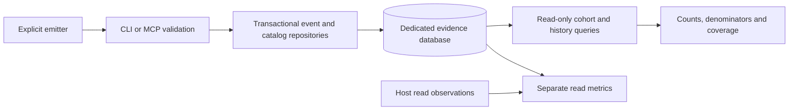

# Explicit lifecycle and catalog evidence

Read counts, lifecycle assertions and catalog inventories answer different
questions. Reading a file does not prove activation; activation does not prove
completion or quality. These interfaces preserve the emitter's explicit evidence
and expose denominators and missing coverage. They do not infer events from
prompts, install hooks, change skills or update a task tracker.

Use Node.js 24+ and a prepared checkout or packed CLI. Select an existing,
canonical absolute data directory owned by the caller. The dedicated SQLite
database is shared with [read telemetry](https://github.com/i-9-ai/skills/wiki/Skill-Telemetry). Catalog lookup
and MCP initialization need no database; only a valid explicit record can create
or upgrade the selected database.



## Record one attempt

Save this complete synthetic example as `routed.json`. Replace its identifiers
and hashes with the caller's actual evidence before reporting real work:

```json
{
  "schema_version": 2,
  "event_type": "skill.routed",
  "event_id": "095db0cf-bd65-4c57-a7e4-757143ab3421",
  "correlation_id": "5cb9910e-6e44-40cb-9cd1-de5b807f250d",
  "occurred_at": "2026-09-19T12:00:00.000Z",
  "source_host": "manual",
  "source_adapter": "cli",
  "session": "db1ba0e1-b790-4d3a-a7e6-9fcb4a791e49",
  "payload": {
    "collection": "demo",
    "skill": "example-skill",
    "source": {
      "repository": "https://example.org/skills",
      "source_ref": null,
      "resolved_git_sha": null,
      "package_path": "skills/example-skill",
      "package_sha256": "bbbbbbbbbbbbbbbbbbbbbbbbbbbbbbbbbbbbbbbbbbbbbbbbbbbbbbbbbbbbbbbb"
    },
    "reason": null
  }
}
```

```sh
node bin/index.mjs telemetry record --db /absolute/local-data/usage.db --file routed.json
node bin/index.mjs telemetry record --db /absolute/local-data/usage.db --file - < routed.json
```

For activation, submit the same attempt with `event_type: "skill.activated"`,
a new occurrence UUID and its actual timestamp. For completion, submit
`skill.completed` with another new UUID and timestamp. Keep the session,
correlation, collection, skill and source identity unchanged within an attempt.
One correlation may select several skills, but cannot mix sessions. A later
attempt needs a new correlation. Each attempt permits one route, one activation
and one terminal event. Missing earlier stages remain missing; arrival order
may differ from occurrence order when timestamps are coherent.

| Event | Meaning asserted by the emitter | Allowed `reason` |
| --- | --- | --- |
| `skill.routed` | Selected for this attempt | `null` |
| `skill.activated` | Explicitly began using its procedure | `null` |
| `skill.completed` | Finished the attempted procedure | `null` |
| `skill.not_applicable` | Selected procedure did not apply | `outside_scope`, `prerequisite_mismatch`, `superseded` |
| `skill.blocked` | Could not proceed | `missing_input`, `missing_dependency`, `permission_required`, `validation_failed`, `unavailable_resource`, `incompatible_environment` |
| `skill.abandoned` | Stopped the attempt | `caller_cancelled`, `superseded`, `execution_interrupted` |

The last four event types are terminal alternatives. A block before activation
is allowed and remains visible as a pre-activation block. Completion is a caller
assertion, not verification that acceptance tests or a professional review passed.

Reuse the identical event ID and canonical content for retries: `recorded: false`
means it already exists. Changed content, a competing stage or inconsistent
attempt identity returns `evidence_conflict`. Event IDs share one namespace with
legacy read events. UUIDs are lowercase, timestamps use UTC milliseconds plus
`Z`, and names are bounded lowercase slugs. Lifecycle input is at most 8 KiB of
strict UTF-8 JSON. Duplicate keys, unknown fields and private free-text fields
such as prompts or task descriptions are rejected before storage is opened.

## Source identity

`repository` may be `null` or a syntactically public HTTPS URL without credentials,
query or fragment. `source_ref` may be `null`; a supplied ref requires a resolved
40- or 64-hex Git SHA, and a SHA requires a repository. `package_path` is portable
and relative; `package_sha256` is a 64-hex content digest. The server neither fetches
the repository nor verifies these submitted claims. Do not substitute a version
or folder digest for a resolved Git SHA.

For interoperable package hashes, enumerate the bounded regular-file package tree,
hash each file's bytes, then sort its portable relative paths by UTF-8 bytes.
Hash the concatenated UTF-8 records `relative-path NUL file-sha256 LF` with
SHA-256. Do not label one entrypoint/resource hash as that package-tree digest.
The server stores the caller's hash and cannot establish how it was calculated.

Queries identify a source by repository and package path (`source_key`) and an
exact revision by source, resolved SHA and package digest (`identity_key`).
Same-named skills from different sources remain distinct. Collection and skill
are at most 64 characters, source refs 128, paths 1024 and repository URLs 2048.

## Observe a complete catalog

Save `catalog.json` with the same schema-2 envelope, a new event and correlation
UUID, `event_type: "catalog.observed"`, `session: null` and this payload:

```json
{
  "collection": "demo",
  "source": {
    "repository": "https://example.org/skills",
    "source_ref": null,
    "resolved_git_sha": null
  },
  "catalog_sha256": "dddddddddddddddddddddddddddddddddddddddddddddddddddddddddddddddd",
  "skills": [
    {
      "skill": "example-skill",
      "package_path": "skills/example-skill",
      "package_sha256": "bbbbbbbbbbbbbbbbbbbbbbbbbbbbbbbbbbbbbbbbbbbbbbbbbbbbbbbbbbbbbbbb",
      "metadata_sha256": "cccccccccccccccccccccccccccccccccccccccccccccccccccccccccccccccc"
    }
  ]
}
```

```sh
node bin/index.mjs telemetry catalog-observe --db /absolute/local-data/usage.db --file catalog.json
```

This is a complete caller-reported inventory, not a server-side scan. It supports
at most 256 unique skills and 256 KiB of JSON. An empty inventory explicitly
removes all previously reported members; never send an incomplete scan as a full
inventory. Observations must advance the collection's occurrence timestamp,
except an identical retry. The transaction retains the inventory, its sequence
and added/changed/removed deltas. Metadata, source or package identity changes
remain visible. Digests identify submitted content; they contain no file bodies.

## Query periods and outcomes

```sh
node bin/index.mjs telemetry lifecycle --db /absolute/local-data/usage.db --from 2026-09-01T00:00:00.000Z --until 2026-10-01T00:00:00.000Z --interval month
node bin/index.mjs telemetry overlap --db /absolute/local-data/usage.db --from 2026-09-01T00:00:00.000Z --until 2026-10-01T00:00:00.000Z --collection demo
node bin/index.mjs telemetry inactivity --db /absolute/local-data/usage.db --from 2026-09-01T00:00:00.000Z --until 2026-10-01T00:00:00.000Z --collection demo
node bin/index.mjs telemetry catalog-history --db /absolute/local-data/usage.db --from 2026-09-01T00:00:00.000Z --until 2026-10-01T00:00:00.000Z --limit 20
```

All four queries require `from` inclusive and `until` exclusive, spanning at most
366 days. Optional `--collection` and `--skill` filter identities; `--limit` is
1–100, default 20. Lifecycle additionally accepts `--interval total|day|month`.
Queries open existing compatible storage read-only and do not upgrade it.

Lifecycle rows separate each exact source revision and UTC bucket. `event_counts`
counts events in the selected period; `attempts` counts represented attempts.
Each ratio includes `numerator`, `denominator` and `rate`, which is `null` when
the denominator is zero:

| Ratio | Numerator | Denominator |
| --- | --- | --- |
| `route_conversion` | Selected routes with a matching activation before `until` | Routes occurring in the row's bucket |
| `completion_rate` | Activations with matching completion before `until` | Activations occurring in the row's bucket |
| `block_rate` | Activations with matching block before `until` | Activations occurring in the row's bucket |

An outcome may occur after the cohort's bucket but before `until`. It therefore
need not equal the completion-event count in that bucket. Earlier routes or
activations may establish matching stages for events in the period. Unmatched
activations, unmatched terminal outcomes and pre-activation blocks have separate
counts. `reactivations` counts activations with an earlier activation of the same
source; `revision_changes` counts those whose previous identity differs. These
are recurrence signals, not user retention or causal evidence of improvement.

Overlap reports skills routed under the same correlation, joint and union
decision counts and their ratio. It does not measure semantic similarity or
justify an automatic merge. Inactivity uses each collection's latest complete
observation before `until`, then finds members with no reported activation in
the period, across revisions of the same source. `first_seen_at` and
`observed_entire_period` disclose partial inventory coverage. No observation
returns `catalog_unobserved`; zero reported activity never proves non-use.

History summaries return `next_sequence`; pass it as `--after-sequence` for the
next page. To inspect changes, use `--observation-sequence` with a returned
sequence, then `--after-skill` with `next_skill`. Summary and detail cursors are
separate. Member changes contain before/after digests and provenance, not files.

## MCP parity, limits and recovery

The same [MCP server](https://github.com/i-9-ai/skills/wiki/Skill-MCP) exposes these contracts:

| MCP tool | Equivalent CLI operation |
| --- | --- |
| `skill_lifecycle_record` | `telemetry record`, schema-2 lifecycle event |
| `skill_catalog_observe` | `telemetry catalog-observe` |
| `skill_lifecycle_metrics` | `telemetry lifecycle` |
| `skill_routing_overlap` | `telemetry overlap` |
| `skill_catalog_inactivity` | `telemetry inactivity` |
| `skill_catalog_history` | `telemetry catalog-history` |

Supply the full event as tool arguments for records. Queries take snake-case
JSON fields, for example
`{"from":"2026-09-01T00:00:00.000Z","until":"2026-10-01T00:00:00.000Z","collection":"demo","limit":20}`.
MCP never accepts a database path in tool arguments; the caller selects storage
when starting the server. Request lines and serialized responses are each bounded
to 1 MiB; individual event contracts retain the smaller limits above.

Queries fail explicitly instead of silently sampling: at most 5,000 indexed
period events or catalog headers, and 100,000 co-routing pair operations.
Unfiltered inactivity considers at most 4,096 historical observations and 64
collections; selecting a collection uses its latest observation directly.
Display limits still report `truncated`; reducing a display limit does not bypass
the work budget. Narrow the period or collection on `query_limit_exceeded`.
On `response_too_large`, request a smaller page. Error messages never echo input
or private paths.

Migration 3 adds lifecycle and catalog evidence while preserving migration 1/2
checksums and observed-read rows. A valid explicit record performs the upgrade;
queries against known older schemas return `schema_upgrade_required`. Stop
writers and retain a caller-owned backup before upgrading. Rollback uses that
backup, not dropped tables. Aggregate-catalog rebuild/reset commands refuse this
dedicated evidence database; they cannot erase its history. Schema mismatch,
unknown versions and changed checksums require diagnosis, with no reset fallback.
Five-second SQLite writer contention and transaction boundaries preserve retries
and prevent partial records. Optional record diagnostics follow the existing
bounded [log contract](https://github.com/i-9-ai/skills/wiki/Skill-Telemetry#storage-logs-and-failures).
