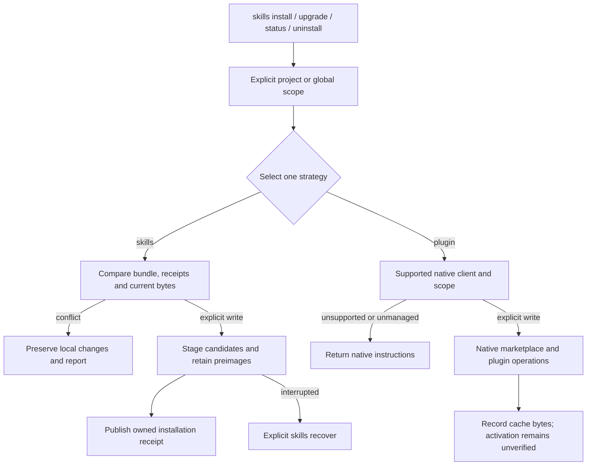

# Managed installation

The toolkit can manage its bundled collection or select a native Codex/Claude
plugin route. These commands require a release containing this interface. In an
unreleased checkout, replace `npx @i-9.ai/skills` with `node bin/index.mjs`.
All mutation commands preview by default; `--write` explicitly applies them.
Installing the toolkit through npm does not install skills or change host settings.

## Choose scope and strategy

`--project ./consumer` selects that project's `.agents` directory. Without a
scope flag, the current working directory is the project. The selected project
must already exist as an ordinary caller-owned directory; writes create only
managed descendants. `--global` selects
`~/.agents`, or the explicit `I9_AGENT_STATE_ROOT` override. The flags are mutually
exclusive. `auto` strategy uses an existing managed installation first; otherwise
it detects executable Codex/Claude clients without launching them. Multiple
clients require an explicit strategy/host choice. Detection never installs an agent.

Choose portable package directories:

```sh
npx @i-9.ai/skills skills install --global --strategy skills
npx @i-9.ai/skills skills install --global --strategy skills --write
npx @i-9.ai/skills skills status --global
npx @i-9.ai/skills skills upgrade --global --strategy skills --write
npx @i-9.ai/skills skills uninstall --global --strategy skills --write
```

The running toolkit supplies the bundle; invoking a newer package with npx
supplies the newer collection. `upgrade` does not update its own executable or
download arbitrary collections. Its JSON distinguishes the running bundle version
from the recorded installed version. Equal owned bytes and metadata produce a
no-op. Package setup is never executed. Installer integrity checks do not claim
a new official validation run, host activation or behavioral quality.

## Ownership and recovery

The private receipt is at `<selected-agent-root>/installation/i9-skills/receipt.json`.
It records collection, scope, package version, catalog digest, available asserted
Git revision and complete package inventories. Discovery uses only
`<selected-agent-root>/skills`; private state and backups remain outside it.

An upgrade compares all managed packages before publishing. Removed or renamed
packages are withdrawn only when their existing bytes match the receipt. Previous
directories are retained in a transaction, rather than discarded. Unmanaged name
collisions, links, changed/missing managed files and a stale receipt block writes.
Existing installations from another installer are not silently adopted. Keep
managing those with their original installer, or migrate them explicitly first.

```sh
npx @i-9.ai/skills skills status --project ./consumer --strategy skills
npx @i-9.ai/skills skills recover --project ./consumer --strategy skills
npx @i-9.ai/skills skills recover --project ./consumer --strategy skills --write
```

Recovery restores verified preimages from an interrupted transaction. It also
handles a stopped owner lock before/after journal publication. A live owner or
post-interruption consumer edits block recovery. A second interrupted recovery
can resume. Receipts and journals have the same fixed 4 MiB admission/read bound;
metadata overflow is refused before installation writes. Each package has at most
2,048 entries, 4 MiB per ordinary file and 32 MiB in total; bundles have at most
64 packages and 128 MiB of content. These are implementation safety bounds.

Uninstallation never removes the skills root, unrelated packages, host settings
or the shared usage database. Receipt-backed removal works independently of a
corrupt or incomplete running skill bundle; its output leaves the uninspected
bundle version null. Retained transaction directories stay available
for inspection; the manager does not automatically prune recovery history.
Operations require stable caller-owned ordinary directories; they do not provide
hostile-race-proof filesystem confinement.

## Native plugins

```sh
npx @i-9.ai/skills skills install --global --strategy plugin --host codex
npx @i-9.ai/skills skills install --global --strategy plugin --host codex --write
npx @i-9.ai/skills skills upgrade --global --strategy plugin --host codex --write
npx @i-9.ai/skills skills status --global --strategy plugin --host codex
npx @i-9.ai/skills skills uninstall --global --strategy plugin --host codex --write

npx @i-9.ai/skills skills install --project ./consumer --strategy plugin --host claude --write
```

The preview lists native commands and the bundled skills/hooks/MCP components.
Writing preflights every requested native command and flag, plus observations. Codex supports
user-scope installation in this adapter; project requests return manual guidance
without widening scope. Claude scopes both marketplace and plugin operations to
the requested user or project scope on initial installation. Refreshes use
`claude plugin marketplace update i9-skills` before a scoped plugin update;
that refresh uses the registered ref and has no scope/ref replacement flag.
Changing an owned Claude source pin therefore returns manual guidance before
dispatch. Repeat marketplace add cannot change it. The adapter preserves the
registration rather than removing a marketplace and its unrelated plugins/data.
After native source changes, continue managing that transition with the native
client; changed cache bytes are not silently adopted. For ongoing CLI-managed
upgrades, explicitly uninstall the owned native plugin before selecting the
portable strategy. Unsupported/missing clients return manual
steps and a nonzero exit for an unfulfilled write request. No client is downloaded.

Native registrations are tracked separately under the same private installation
state. The adapter records the native response, requested revision and complete
cache digest. Before admitting success, it also compares the installed catalog
and every skill package with the running toolkit's bundle. A matching version
alone is insufficient; different bytes leave the operation pending. Native
responses do not establish the actual immutable Git revision, and the result
labels that as unobserved. The package comparison does not qualify native
hook/runtime bytes or execution.

It refuses adoption of an existing unowned plugin, changed cache
bytes or client selection, and duplicate loose/managed plugin routes. A disabled
plugin requires native UI review for either install or upgrade instead of implicitly re-enabling it.
Removing the owned plugin preserves its marketplace registration and unrelated
plugins. Native cache preimages are retained before upgrade/removal.

After a failed native operation, its bounded pending record includes completed
commands and retained preimages. Native settings and rollback belong to the host
client: `skills recover --strategy plugin --host ...` reports manual reconciliation
and never treats that as a completed rollback. Native status checks the recorded
cache; it labels live host status as not probed. Installation/byte observations do
not establish hook/MCP activation or provider behavior. Missing or unsafe cache
paths return a JSON conflict; invalid receipt schemas still fail validation. See
[native lifecycle evidence](https://github.com/i-9-ai/skills/wiki/Native-Plugin-Pilot).

Native command references: [OpenAI marketplace setup](https://developers.openai.com/plugins/build/plugins#add-a-marketplace-from-the-cli),
[Claude marketplace registration and pinning](https://code.claude.com/docs/en/plugins/host-marketplace).
The [Claude marketplace command contract](https://code.claude.com/docs/en/plugins/cli-reference#plugin-marketplace-update)
explains refresh versus source-pin replacement.

## Entry paths


