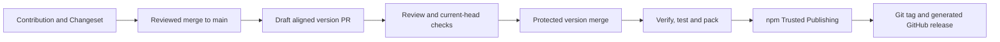

# Release management

## Purpose

This repository uses [Changesets](https://github.com/changesets/changesets) to record pending release notes and semantic version intent. It separates contribution review, generated version review and publication: the reviewed version PR's protected merge triggers the authorized npm and GitHub release workflow.

## Normal contribution flow

1. Make and validate the change.
2. Add a Markdown entry under `.changeset/` for a user-visible release change with `npm run changeset`.
3. Review the resulting version intent and release-note wording in the pull request. Reconcile the note against the complete user-visible diff: describe concrete capabilities, commands or interfaces when material, and meaningful limits. Do not use a generic summary when one Changeset represents a broad foundational delivery.
4. Run `npm run changeset:status`; GitHub Actions performs the same read-only validation.
5. Merge the change only through the usual repository review process.

Changesets may be omitted only for changes that have no user-visible release note, such as purely local test-fixture maintenance. Explain that decision in the pull request.

## Automated release flow

The [Release packages workflow](https://github.com/i-9-ai/skills/blob/main/.github/workflows/release.yml)
runs on default-branch pushes and explicit dispatches. A merged contribution with
pending version intent creates or updates a **draft version PR**. After that PR
passes review and protected-branch checks, its merge runs release verification,
repository checks and compiled-package checks, publishes the official packed
artifact to npm, and creates its Git tag and GitHub release from `CHANGELOG.md`.



The official Changesets `select-mode`, `version`, `pack` and `publish` actions
are pinned to `ae32849d5ba541f9ae29e40e22a623bc13562f51` (`v2.1.2`) for CLI
`3.0.2`. Preparation uses `npm run release:prepare` to align package, lockfile
and Codex/Claude/Copilot plugin versions. Publication verifies that the release
at the triggering commit reproduces the preceding commit's pending notes;
unrelated changes or fabricated versions fail. The official packed artifact is
passed to the publish action rather than replacing its command or repacking a
different checkout.

No pending notes and no unpublished version is a successful no-op. Notes without
a package bump stay untouched. Linked notes, malformed intent and unsupported
prerelease state are rejected before selecting an action. Runs on other branches
or tags are skipped. Concurrent release runs are serialized.

### Publisher and repository prerequisites

Keep default workflow permissions read-only. Enable **Settings > Actions >
General > Allow GitHub Actions to create and approve pull requests** so the
version action can create its PR; the workflow does not approve reviews or merge
PRs. Its version job has only `contents: write` and `pull-requests: write`.
Only its publication job receives `id-token: write`.

Configure npm Trusted Publishing for this exact binding:

| Field | Value |
| --- | --- |
| Package | `@i-9.ai/skills` |
| GitHub owner / repository | `i-9-ai/skills` |
| Workflow filename | `release.yml` |
| Environment | None |
| Allowed operation | `npm publish` |

An authenticated package owner can configure it with npm 12:

```sh
npm trust github @i-9.ai/skills --file release.yml --repo i-9-ai/skills --allow-publish
```

This administrative operation requires the owner's authentication. Do not store
an `NPM_TOKEN` or weaken 2FA. npm exchanges the hosted workflow's OIDC identity
for a short-lived publication credential. Node 24 and npm 11.5.1+ are required;
the publish job uses a GitHub-hosted runner. The public package and matching
repository metadata allow npm provenance for this supported flow. Tests or a
configured binding do not prove a completed upload. See the
[official npm contract](https://docs.npmjs.com/trusted-publishers/).

According to the [GitHub trigger contract](https://docs.github.com/en/actions/how-tos/write-workflows/choose-when-workflows-run/trigger-a-workflow),
PR creation and updates with `GITHUB_TOKEN` create PR checks in an
approval-required state. A maintainer with write access selects **Approve
workflows to run** in the PR banner. Review the generated diff, wait for checks
on its current commit, and mark the draft ready when appropriate. An updated
version PR returns to draft so its new content is reviewed again. No stored
GitHub App or personal token is required for this approval path.

### Verify publication and recover a failure

Inspect the workflow result, registry version, `latest`, integrity, version tag
target and generated GitHub release. Exercise `npx --yes @i-9.ai/skills --help`,
catalog retrieval and the stdio MCP handshake from a disposable anonymous
consumer with fresh HOME/cache and no publisher credentials. Keep sanitized
commit, artifact and consumer receipts outside the checkout. Initial distribution
and consumer evidence are recorded in
[issue #17](https://github.com/i-9-ai/skills/issues/17).

A published name/version cannot be overwritten. Correct it with a new Changeset
and version. Check registry state before retrying an ambiguous upload.
Changesets skips versions already present in npm, so a retry after a successful
upload does not automatically recover a missing GitHub tag/release. Never move
an existing version tag. For a tag without its release, verify its target and
recover the release from that version's generated changelog separately, without
re-uploading npm. Unpublishing, deprecation, marketplace submission and consumer
installation remain separately authorized operations.

### Restore the original 0.1.0 GitHub release

The first npm upload preceded this integrated automation. The explicit
`backfill-0.1.0` dispatch restores only its missing GitHub metadata:

```sh
gh workflow run release.yml --ref main -f operation=backfill-0.1.0
```

The job checks out reviewed source commit
`468de535b715c817a1eda72682f15f9e55e52fdc`, verifies aligned versions and no
pending notes, then runs the official CLI `git-tag` through the pinned root
Changesets action. Git CLI push preserves that historical target; the ordinary
action API path would use the newer workflow commit. The job has only
`contents: write`, no npm upload command and no OIDC publication permission.
It creates `v0.1.0` and the release from its original generated changelog.
A verified existing tag/release makes a rerun a no-op. An existing tag without
a release fails for explicit recovery rather than moving it or re-uploading npm.

## Prepare locally

Use a dedicated branch in an owned, stable checkout with Node.js 24+ and an
explicit `npm ci`. The following command is an intentional local mutation for a
version-preparation task:

```sh
npm run release:prepare
npm run release:verify
git diff --stat
git diff --check
```

The direct forms are `node bin/index.mjs repo prepare-version --project .` and
`node bin/index.mjs repo verify-release --project .`. The explicit project path
selects the repository being prepared. These commands neither install their
dependencies nor publish, commit, push or create a PR. Create the version commit
and PR through the normal repository delivery process after inspecting the diff.

Preparation returns JSON with `version`, `changed` and the number of consumed
`notes`. Repeating it after all notes are consumed succeeds with `changed: false`
and no file changes. The supported input is this single-package repository with
the standard Changesets changelog generator, matching package/lock/plugin
versions, and no active prerelease state. Workspaces and custom commit/changelog
hooks are rejected. The development Changesets dependency is required for
preparation and for verification against a base; it is not bundled into the
consumer CLI's production dependencies.

Both `.changeset/pre.json` and `.changeset/pre` are unsupported, including linked
state. The CLI and workflow reject them before running Changesets, since even
the upstream status operation can migrate legacy prerelease state. Hidden
Markdown, README files and the supported host instruction filenames are left
untouched rather than interpreted as release notes.

The selected project must be an independent package. Package discovery also
rejects a child inside an ancestor workspace, so preparation cannot silently
target files outside the selected project.

Changesets configuration must explicitly set `format: false`. This keeps
generated changelog content reproducible without auto-detecting or executing a
local formatter. Source formatting still uses the normal repository check.
Preparation removes whitespace-only indentation from new release entries and
strict verification reproduces that same canonical output. This normalization
leaves existing release history and generated nonblank Markdown and code
indentation unchanged.

If preparation fails, the adapter restores its captured manifests, pending notes
and changelog. Diagnose the reported error before retrying; do not overwrite
unrelated changes or manually fabricate generated versions. A missing development
dependency requires an explicit `npm ci` in the trusted source checkout.

## Verify a generated version

`npm run release:verify` checks package, lockfile and plugin version alignment
without changing the checkout. After committing a candidate version, compare it
against the full base commit SHA from before preparation:

```sh
npm run release:verify -- --base <full-base-commit-sha>
```

This stronger mode requires a clean tracked worktree and checks that the diff
contains only the generated package/lock/plugin metadata, changelog and removed
pending notes. It recomputes the expected version and complete changelog with the
pinned Changesets CLI from the base commit's notes and existing release history,
then requires an exact match. Missing or altered entries and unrelated edits
hidden inside allowed manifest files fail verification. The comparison uses the
committed changelog after checking worktree cleanliness and file safety, so a
normal Git newline conversion in the checkout does not change release evidence.

Verification requires complete local Git history. A disposable directory reads
existing Git objects at the immutable base to reproduce note commit references,
without sharing the selected checkout's refs, index, configuration or hooks.
Git fetching and formatter execution are disabled. The selected checkout is
read-only and the disposable directory is removed afterward.

The [release-note workflow](https://github.com/i-9-ai/skills/blob/main/.github/workflows/changesets.yml) first runs normal
Changesets status against the PR base or preceding push commit. When a prepared
version has consumed its notes, the strict verifier must establish that complete
generated-release evidence instead. Branch names, empty note directories and a
version change alone never bypass the check. Failed verification leaves the job
failed; it does not waive other required checks.
