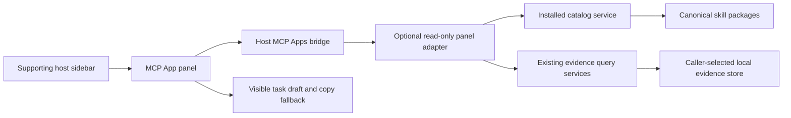

# Optional skill-management sidebar panel

Status: design proposal. No MCP App, sidebar registration, host installation or
website announcement is delivered by this document or its preview.

Shared implementation backlog: [issue #106](https://github.com/i-9-ai/skills/issues/106).
The proposal delivery does not close that implementation issue.

## User outcome and authority

Provide an I-9 Skills entry in a supporting host's sidebar, opening a useful
skill-management panel. A user can find a skill, inspect its responsibility,
prepare a task, and inspect available local evidence in one place.

The current request authorizes research and a concrete proposal. This change
delivers the proposal, a disposable visual preview and the durable website
maintenance rule. Runtime implementation, native installation, public MCP
hosting, plugin submission and deployment remain distinct delivery stages.
The caller request owns this proposal; issue #106 tracks future implementation
and native acceptance. Beads tracks the bounded proposal separately from those
future stages. Design choices remain proposed until reviewed by the user.

## Observed starting point

The inspected source is main commit
`7493199a9dd6a010ab6a5fc5c9284bb2aedf1591`, package version `0.3.4`.

- `.codex-plugin/plugin.json` selects the canonical `.agents/skills/`, a local
  MCP and native hooks. Its starter prompt is presentation metadata.
- `mcp/codex.json` starts a Node 24+ stdio server without installing runtime
  dependencies into the Git-backed plugin.
- `SkillMcpTransport` advertises only tools. It has no HTML resources,
  `resources/list`, `resources/read`, MCP Apps bridge or sidebar entrypoint.
- Existing read tools cover bundled catalog search, resource inspection,
  observed-read rankings, lifecycle metrics and exact-revision quality evidence.
- Catalog reads concern the bundled installed collection. That is different
  from project/global discovery and from the identities stored in the evidence
  database. Similar names cannot silently join these sources.
- Existing local telemetry defaults to `~/.agents/skills-usage.db`; reads and
  distinct sessions do not establish activation, quality or importance.
- The public submission projection contains 24 skills and excludes hooks,
  local MCP and optional persistent-command setup. It remains unchanged here.

The supplied screenshot shows an Atlassian navigation item. Its exact backend
and opened surface have not been inspected. It is not proof that TWG supplies
the item. This session's computer-use tool prohibits interacting with Codex
itself, so native sidebar behavior is unverified.

## Verified extension contract and limits

Reviewed official documentation on 2026-10-10:

- [Plugin Extensions](https://developers.openai.com/plugins/build/extensions):
  a sidebar app is an MCP App with a global entrypoint in tool metadata.
- [MCP App UI](https://developers.openai.com/plugins/build/chatgpt-ui): a tool
  selects a registered UI resource; the component communicates through the host
  bridge. Tools must retain a useful nonvisual workflow.
- [Package format](https://developers.openai.com/plugins/build/plugins):
  plugin metadata, bundled resources and provider-specific extensions have
  separate ownership. Local installation and public submission differ.
- [Connection testing](https://developers.openai.com/plugins/deploy/connect-chatgpt):
  installed skills, tools, resources and representative user flows need actual
  host testing. A custom remote connection and a published plugin are distinct.

The proposed fixed resource is `ui://i9-skills/panel/v1.html`, with MIME type
`text/html;profile=mcp-app`. Its opening tool would advertise:

```json
{
  "_meta": {
    "ui": { "resourceUri": "ui://i9-skills/panel/v1.html" },
    "openai/ui": { "entrypoints": [{ "type": "global" }] }
  }
}
```

These field names are protocol references; no upstream implementation, artwork
or substantial documentation text is copied. No SDK dependency is added by
this proposal. Pin versions, licenses and source identities before reuse in an
implementation.

The documentation describes ChatGPT sidebar apps. The universal plugin
directory alone does not prove support for this exact extension in a selected
Codex desktop version or for a locally configured stdio server. Those are the
first native feasibility questions. Browser rendering and MCP conformance
cannot substitute for observing the installed entry in that host.

## Proposed experience

The primary surface is Explore, with a secondary inspector. Use the existing
field-manual palette and typography in `website/DESIGN.md`, adapted to a
compact product interface. Host theme and accessibility take precedence over
fixed branding. English is the baseline, with equivalent PT-BR and Spanish UI
before declaring the panel broadly available.

| Area | Useful behavior | Boundary |
| --- | --- | --- |
| Catalog | Search names, descriptions and tags; inspect one selected result | Begin with the bundled collection; display actual source and version |
| Skill inspector | Show responsibility, entrypoint, available references and evidence identity | Resolve reviewed resources; render Markdown as inert content |
| Prepare a task | Draft create, review or evolution prompts for the selected workflow | Explicit user action; visible draft and copy fallback; no automatic send |
| Evidence | Show observed reads, distinct sessions and qualified outcomes for an explicit collection and period | Missing evidence is unavailable, not zero or poor quality |
| Connection status | Explain missing MCP, unsupported UI, incomplete discovery and unavailable evidence | No setup, installation or hook activation as a side effect |

A selected package name, source-qualified identity and exact revision form the
handoff context. If the host cannot attach that context safely, copy a prompt
that asks the agent to resolve and verify the package before using it. Do not
guess a skill/plugin mention or treat a name match as a verified dependency.

The preview offers three views of one concept: catalog and inspector
(recommended entry), compact list, and evidence. It shows an empty evidence
state instead of invented rankings. Preview interactions only change the
page's in-memory state; they do not call MCP, write local evidence or start a
conversation.

## Architecture options

| Option | Advantages | Costs and limits | Decision |
| --- | --- | --- | --- |
| Optional local MCP App adapter over existing services | Keeps caller evidence local; reuses canonical catalog and evidence; preserves current CLI | Native global-entrypoint and stdio support must be demonstrated; UI assets must be shipped ready to use | Recommended first |
| Hosted read-only catalog MCP App | Easier access from web clients and public endpoint review | Requires operated HTTPS service, authentication decisions and review; cannot read a user's home or local SQLite | Separate later scope |
| Promotional website in an embedded frame | Reuses an existing public surface | The website lacks local collection/evidence access and an agent task bridge; iframe policy adds constraints | Keep as marketing, not the panel backend |

Keep the CLI, skills and shared services as the portable core. Add a narrowly
scoped optional UI adapter rather than placing host APIs in any skill body.
The adapter exposes only panel read operations; its tool catalog and dispatch
must exclude mutation operations, not merely hide write buttons. The existing
full MCP remains a separately configured capability. Use distinct panel tool
names to avoid duplicate generic catalog operations across adapters.



The diagram describes proposed boundaries, not a deployed integration. The
read-only panel adapter's connection shares services and data with the existing
tooling; it owns no second catalog, database or skill implementation.

### Component responsibilities

- `SkillPanelToolConfiguration`: fixed resource identity, bounded read tool
  contracts and optional host extension metadata.
- `SkillPanelService`: compose existing catalog/evidence results into a compact
  view model; retain source, coverage and assurance distinctions.
- `SkillPanelMcpTransport`: protocol ingress and resources for the read-only
  panel profile; reject other methods and all mutation dispatch.
- `SkillPanelAssetRepository`: load only declared prepared assets, verify
  bounds and identity, and return the fixed UI resource.
- `SkillPanelRequestValidator`: closed query schemas, fixed view selections,
  opaque admitted collection IDs and bounded periods; no arbitrary paths.
- Browser component and host adapter: semantic rendering, transient UI state,
  bridge capability detection, and an explicit task-draft handoff.

Retain singular N-layer directories and matching class/filename conventions.
The exact runtime layout and command route belong in the reviewed execution
plan after the feasibility result, not in new empty source folders now.

### Build and distribution constraint

The current root plugin must remain usable without consumer-side `npm ci`.
Prefer a bundled browser bridge and UI asset prepared during development and
release. Adding an SDK import to a Git-backed native entrypoint without
shipping its dependency would break that contract.

Candidate build-time libraries are the official MCP Apps browser SDK, the
OpenAI MCP Extensions SDK where needed, and a small bundler. Evaluate their
actual APIs and licenses before pinning them. A server SDK, if adopted, needs
a self-contained distributed runtime or a separate explicitly selected npm
adapter. No unpinned event-time download, hidden compilation or universal
browser/Codex support claim is acceptable.

Use the shared MCP Apps bridge for portable UI behavior. Limit OpenAI-specific
entrypoints and conversation handoff to a host adapter. Unsupported hosts keep
the existing CLI, textual MCP results and skill entrypoints.

## State, trust and error behavior

- Read-only opening must not create/migrate a database, observe a read, record
  activation, configure a host, write a preference or install anything.
- The evidence query selects an explicit collection identity and period.
  Bound the result and preserve revision/coverage information. Do not join
  observations to a bundled skill by name alone.
- Keep filter, selection, theme and draft state in the rendered UI instance.
  Durable evidence stays in the existing caller-controlled store.
- Render descriptions, resource text and diagnostic messages as untrusted
  text. Never execute a skill's scripts or render its HTML directly.
- Use prepared local assets, narrow CSP and no remote fonts, trackers, general
  filesystem endpoints or arbitrary external URL loading.
- A disconnected bridge presents an honest unsupported/connection state and
  manual fallback. An absent evidence store presents no-data guidance.
- A corrupt or incompatible store produces a bounded error; no automatic
  migration, repair, replacement or deletion occurs.
- A user may prepare an evolution request from evidence. Counts alone must
  not recommend deleting, demoting or promoting a skill.

## Staged delivery and acceptance

1. **Proposal (this change):** retain official source links, local gap mapping,
   preview, authority limits and the website maintenance rule. Inspect the
   preview's main interactions and narrow/wide layout.
2. **Native feasibility:** register one read-only fixture tool and prepared UI
   resource in an isolated owned test profile. Observe whether the selected
   Codex version offers a global entry and launches the component. Retain exact
   host/runtime versions, source identity, resource digest, UI evidence and
   restoration result. A failed or unavailable observation stays unresolved.
3. **Catalog vertical slice:** support fixed resource listing/reading, real
   bounded catalog results, safe details and an explicit task draft. Test the
   installed Git and npm layouts without a new skill tree or build on activation.
4. **Evidence view:** add explicit identity/period selection and existing
   read-only evidence queries. Verify absent-store behavior and zero mutation
   of the real evidence store under disposable fixtures.
5. **Product delivery:** add documented opt-in configuration, user-visible
   Changeset, equivalent locale strings and accessibility checks. Update the
   website, docs and entry-path diagrams in the same delivery, describing only
   demonstrated host support and published capabilities.
6. **Additional distribution:** evaluate hosted/public-directory UI separately;
   preserve the skills-only submission profile until that path has its own
   supported configuration, review and authorization.

Before shipping runtime code, cover resource URI rejection, payload bounds,
read-only dispatch, inert Markdown, malformed bridge messages, no-data and
error states, locale/theme changes, keyboard navigation and fallback behavior.
After explicit `npm ci`, run `npm run check`, `npm run package:check` for changed
distribution behavior and `git diff --check`. Use official `skills-ref` for
changed packages. Obtain independent review on the exact implementation commit.
Actual sidebar registration, provider execution, release and deployment require
their own evidence; structural checks cannot mark those stages complete.

## Website maintenance and instruction map

The latest user direction is durable: noteworthy delivered capabilities must
be reflected on the site, alongside documentation, in the same PR. Check
English, Portuguese and Spanish, verified commands, generated catalog links,
screenshots/diagrams when affected, and the actual delivery/host limits.
Do not advertise this proposal as a working sidebar panel.

Current and target hierarchy are unchanged: root `AGENTS.md` owns the shared
delivery rule; `plans/AGENTS.md` owns this proposal and its design preview;
`website/AGENTS.md` owns future site source/build work; `src/AGENTS.md` and
`tests/AGENTS.md` will govern implementation and acceptance tests. Add one plan
index entry. Create no child contract for this incidental preview folder and
no instruction file inside distributed packages.

## Removal and rollback

The proposal changes no runtime. Remove its plan/index/preview together if it
is superseded, preserving Git provenance and the independently requested
website maintenance rule. The future panel must be optional: removing its
registration and assets restores the existing textual CLI/MCP and skill flows.
Never delete caller evidence or alter installed skills as part of rollback.

## Preview

Open [the standalone design preview](previews/Skills%20Sidebar%20Panel.html).
It is a local proposal artifact with bundled-catalog metadata, in-memory
controls and no MCP/host connection. It is excluded from npm distribution and
from the public website build. Browser checks demonstrate only the design.
